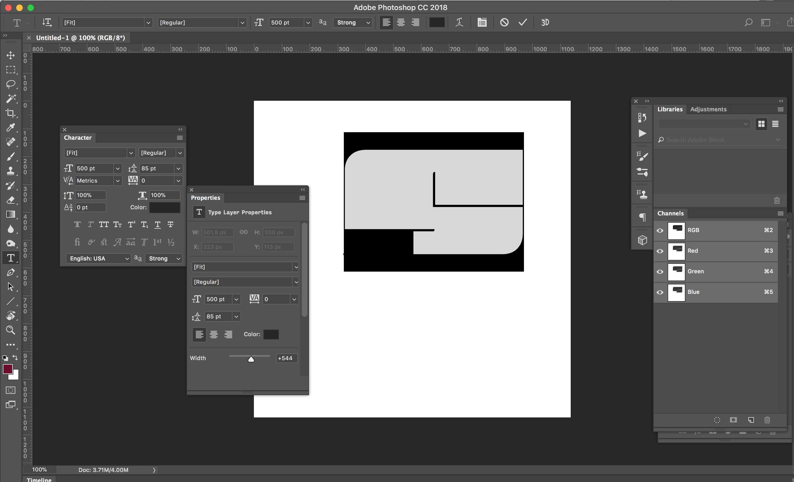

# fit-vf-test

The files in this repo document a variable font where the points don’t seem to be moving as they should be. The variable font was created with:

* fontmake 1.3.1.dev0
* fonttools (as of 2017-11-05, commit a35707560cca9ae232d5e2b39c563d17586b9fd4)

When the width axis value is higher than default, the font appears to have a chunk missing from the bottom left of the letter. It appears that the points at the bottom left do not move correctly relative to the rest of the letter.

I see this issue in <del>fontview v0.2.3</del> (edit: [now fixed](https://github.com/fonttools/fonttools/issues/1103) in FontView), <del>browsers</del> (edit: Chrome and Safari on High Sierra seem to be fine), and in Photoshop CC 2018 (19.0 release) and Illustrator CC 22.0.1.

How the wide S should look (from 3-vf/Fit-UltraExtended.ufo in RoboFont)

